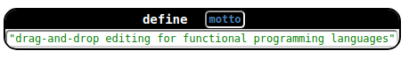

# Language Guide

[TODO] This documentation was written early in the development of this
project. Before releasing it, check it all against the code, which may
have changed in the meantime.

This is a brief guide on how to add support for a new language in
CodeMirror-Blocks.

## Logistics

[FILL]

## Adding a Language

Here is an example of how to add a language to CodeMirror-Blocks:

    import WeschemeParser from './WeschemeParser';
    import CodeMirrorBlocks from '../../blocks';
    
    require('./style.less');
    
    export default CodeMirrorBlocks.languages.addLanguage(
      {
        id: 'wescheme',
        name: 'WeScheme',
        description: 'The WeScheme language',
        getParser() {
          return new WeschemeParser();
        },
        getRenderOptions() {
          return {
            lockNodesOfType: ['comment', 'structDefinition']
          };
        },
      });

The call to `addLanguage` takes the following arguments:

* `id` is a short alphanumeric identifier to be used internally.
  [TODO: how exactly is this used, e.g. might it show up in error messages?]
* `name` is a human-facing name for the language.
  [TODO: when is this actually shown?]
* `description` [TODO: should say where this is used, or remove it if it's not]
* `getParser()` is a function of no arguments that returns a parser
  for your language. This parser must have a function `parse(text:
  String) -> AST`:
  - The `text` argument is a String, with newlines separated by `\n`.
  - The result is an `AST`, as defined in `src/ast.js`. This AST will
  have nodes that are specific to your language. The rest of this
  guide describes how to define these node types.
* `getRenderOptions` [FILL]

You can see that this file is also importing a
[`lesscss`](http://lesscss.org/) style file. Follow
[the stylesheet guide](stylesheet.html) to style your blocks with
`lesscss`.

## Defining Node Types

Let's see how to define a new node type, using the example of variable
definition nodes. As text, these nodes will look like this:

    (define motto "drag-and-drop editing for functional programming languages")

and as blocks, they'll look like this:

We'll walk through the code to add this kind of node, piece by piece.

#### Setup

Our new node type must extend `ASTNode`, which is defined in `src/ast.js`.

    class VariableDefinition extends ASTNode {

And we'll want a constructor. `ASTNode`'s constructor takes a `from`
and a `to` source location (in CodeMirror `{line:_, ch:_}` style), a
name for the node type, and a set of open-ended options that you can
use however you like. After that, you can set whatever fields are relevant for
this node (in this case, `this.name` and `this.body`). And finally, every node
must store a hash of its contents.

      constructor(from, to, name, body, options={}) {
        super(from, to, 'variableDefinition', options);
        this.name = name;
        this.body = body;
        this.hash = hashObject(['variableDefinition', name.hash, body.hash]);
      }

Our new node type must now implement some methods.

#### To Description

The `toDescription(level)` method describes the node aloud for a
screen reader. 

      toDescription(level){
        if((this['aria-level'] - level) >= descDepth) return this.options['aria-label'];
        let insert = ["literal", "blank"].includes(this.body.type)? "" : "the result of:";
        return `define ${this.name} to be ${insert} ${this.body.toDescription(level)}`;
      }

[TODO: this if statement's conditional is leaking implementation details; there should be a method for that.]

#### Rendering as Text

Nodes need to know how to render themselves as text. Furthermore, the
_best_ way to render something as text depends on the width of the
screen (narrow screens should cause things to wrap more easily), so we
can't simply use a `toString()` method. Instead, nodes have a
`pretty()` method that returns a pretty-printing "`Doc`" that can
adapt itself intelligently to different screen widths.

This _particular_ node type is an s-expression, so it can just use the
pretty printing library's built-in support for displaying various
kinds of s-expressions:

      pretty() {
        return P.lambdaLikeSexpr("define", this.name, this.body);
      }

To learn how to implement `pretty()` in general, see the
[pretty printing guide](pretty.html).

#### Rendering as a Block

Finally, our node needs to know how to render itself as a block. This
is accomplished by a `render(props)` function that returns a DOM node:

    render(props) {
      const body = this.body.reactElement();
      return (
        <Node node={this} {...props}>
          
            define
            <Args>{[this.name]}</Args>
          
          
            {body}
          
        </Node>
      );
    }

Specifically, this is a
[React "Function Component"](https://reactjs.org/docs/components-and-props.html).
Read the React documentation for an overview of what Components are
and how you can define them.

Beyond that, here are things you should know about defining
CodeMirror-Blocks components:

- This function was written using
  [JSX](https://reactjs.org/docs/introducing-jsx.html), which makes it
  easier to embed React elements in Javascript. This is what allows
  the HTML-like syntax like ` ... `.
- All blocks should start with a `<Node>...</Node>` element. Make sure
  to pass it the `node` prop, as well as whatever props were passed into this
  node (using the special `{...props}` syntax).
- The `blocks-operator` span makes the black bar at the top of the
  block, and the `blocks-args` span makes the section at the bottom.
  For more options, see the [stylesheet guide](stylesheet.html).
- Blocks should come with ample "drop targets": spots that you can
  drag other blocks onto. There are two ways to get these:
  - `<Args helpers={helpers}>...</Args>` expects an array of elements,
    and intersperses them between drop targets. If the array might be
    empty, you must also pass it a `location={SRCLOC}` property so
    that it knows where to insert.
  - [FILL: describe `ComponentWithDropTargets`.]
- To render a child that is also an `ASTNode`, use `child.reactElement()`. This
  produces a React Element. If you wish to pass it any `props`, you may pass
  them in as a dictionary: `child.reactElement({prop: value})`.
- You may sometimes find that a Function Component is not enough to render your
  AST node, and you want the full power of a Class Component. If so, write an
  ordinary React Class Component, and then in your AST node definition, instead
  of supplying a `render()` method, supply a `reactComponent()` method that
  returns that class. (We really do mean "return the _class_". Don't instantiate
  it!)

That's it! We've fully defined the `VariableDefinition` node type.
